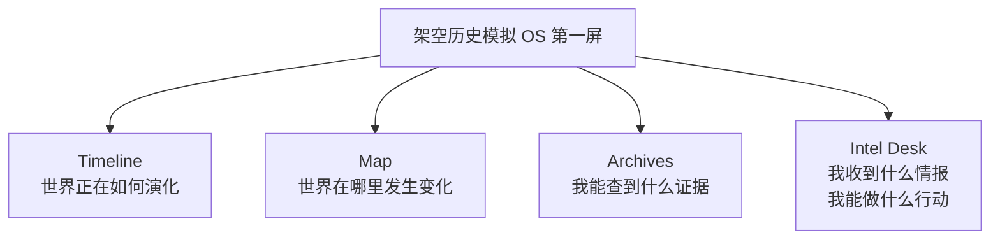

# Round 005 - OS 第一屏不是 App 图标，而是态势感知面板

日期：2026-05-17

## 本轮问题
如果它是一个“架空历史模拟 OS”，这个 OS 的桌面上应该有哪些核心 App？

## 用户纠偏
用户认为第 5 轮不应先问“桌面上放几个 App”，而应先问更本质的问题：

玩家打开这个 OS 的第一分钟，必须立刻理解三件事：

1. 这个世界正在发生什么？
2. 我手里掌握了什么信息？
3. 我现在能做什么干预？

因此第一屏不应是 10 个 App 图标，而应是 4 个核心区域。

## 第 5 轮确认判断
第一版 OS 桌面应优先保留四个核心入口：

1. Timeline 时间线
   - 世界演化的主轴。
   - 告诉玩家过去发生了什么、现在正在酝酿什么、哪些事件可能在未来爆发。
   - 没有时间线，架空历史会散成设定碎片。

2. Map 地图
   - 历史结构的空间化。
   - 呈现国家边界、战线、港口、铁路、资源区、民族分布、贸易路线等。
   - 没有地图，玩家很难相信这个世界真的在运转。

3. Archives 档案馆
   - 历史调查的核心入口。
   - 查人物、条约、会议记录、旧报纸、军令、密信、真实史料和架空档案。
   - 承担“证据感”。

4. Dispatch / Intelligence 收件箱与情报板
   - 将 Telegraph 和 Intelligence Board 合并成一个入口。
   - 负责接收电报、密信、外交照会、线人报告、未证实传闻。
   - 让玩家判断真假、排序优先级、决定下一步行动。
   - 可命名为 Dispatch 或 Intel Desk。

## 第一屏结构

## 延后或嵌入的模块
Newspaper、Network、Almanac 不应消失，但第一版可以先作为“嵌入视图”：

- 报纸：出现在 Archives 里，或作为 Timeline 某个事件的材料。
- 人物关系网：从某个人物档案中打开，而不是一开始独立成 App。
- 年鉴：作为 Map 或 Archives 的数据层，例如点击国家后显示人口、财政、军力、工业、粮食。

## 暂不进入 MVP 的高级功能
事件模拟器和世界线管理器更像高级功能，不适合第一版就做。

原因：否则产品会过早变成“功能堆砌”，而不是一个有入口、有节奏、有沉浸感的 OS。

## 本轮产品原则
第一屏必须让玩家同时看见：

- 历史演化
- 空间结构
- 证据材料
- 可执行行动

## 下一轮问题
第 6 轮：这个 OS 的默认开局，应该让玩家选择一个历史时期，还是先给玩家一个“异常事件”作为入口？

异常事件例子：
- 某封本不该存在的电报。
- 某个本不该提前死亡的人物提前死亡。
- 某场战役结果被改写。
- 某份档案与真实历史不一致。

## Skill / 架构流程备注
用户提到“整一个架构过程应该可以开启 Superpower 这个 skills”。当前会话可用 Skill 列表中未看到名为 `Superpower` 的 skill。若用户指的是多 Agent 架构增强流程，后续可使用 `agent-swarm` 或架构/规划类子 Agent 来做并行推演。
